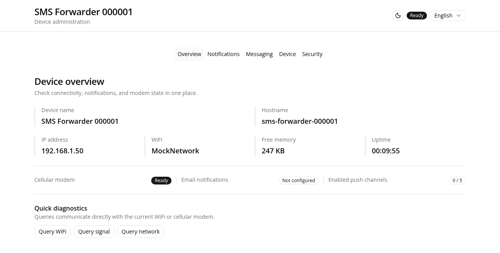
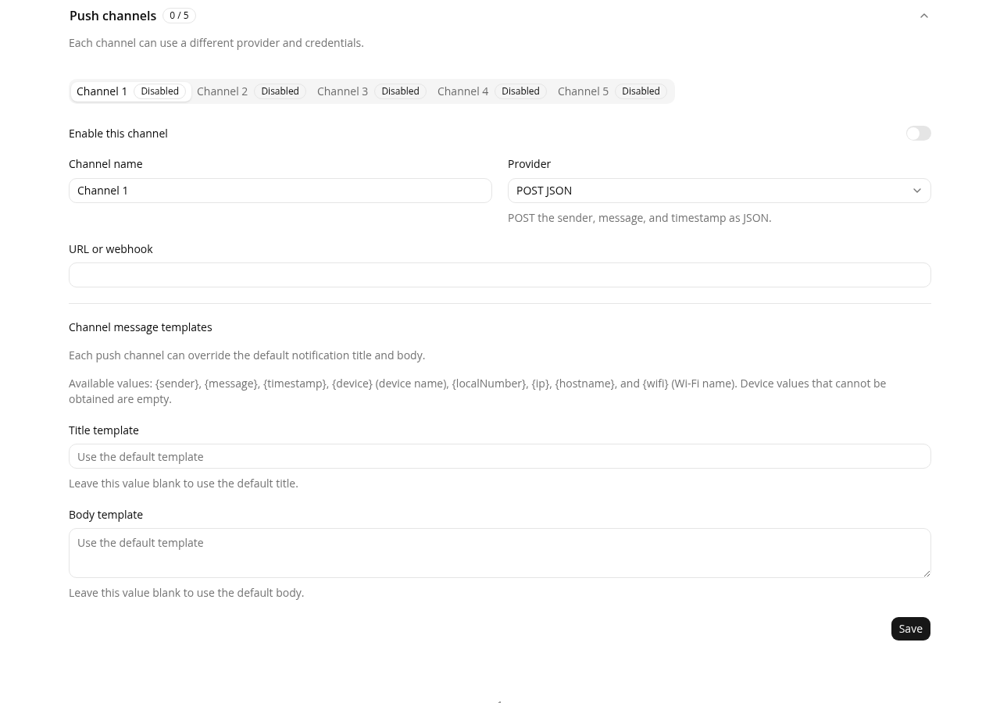

# Low-Cost SMS Forwarder

[繁體中文](README.md) | [简体中文](README.zh-CN.md) | [English](README.en.md)

This project uses an ESP32-C3 and an ML307-series 4G modem. It forwards received SMS messages to email or push services.

[Management UI demo](https://lekoowo.github.io/sms_forwarding/) · [Video guide](https://www.bilibili.com/video/BV1cSmABYEiX) · [Old LuatOS branch](https://github.com/chenxuuu/sms_forwarding/tree/old-luatos)

> The demo does not connect to a device. It disables backup, restore, and OTA operations.

## Features

- Provides a web UI for configuration and status in Traditional Chinese, Simplified Chinese, and English.
- Forwards SMS messages to email or up to five push channels at the same time.
- Gives each push channel a separate name, title template, and body template.
- Supports multipart SMS messages, a blacklist, web SMS sending, and network diagnostics.
- Sets a device name and hostname to identify multiple devices.
- Exports an encrypted configuration backup and restores it to another device.
- Installs signed OTA updates from the web UI and rolls back after an unsuccessful boot.
- Keeps paginated logs in RAM only, without wearing flash.

The device only uses received SMS messages for notification forwarding. It does not execute remote-control commands from message content.

## Push services

The firmware supports POST JSON, Bark, GET, DingTalk, PushPlus, ServerChan, Custom JSON, Feishu, Gotify, and Telegram.

Templates can include the sender, message, timestamp, device name, local number, IP address, hostname, and WiFi name. Custom JSON provides a complete request-body template.

| Device overview | Push channels and templates |
|---|---|
|  |  |

## Hardware and wiring

The verified combination is an ESP32-C3 Super Mini and an ML307R-DC. The device needs 4 MB flash, a Nano SIM, and a suitable antenna.

| ESP32-C3 | ML307R-DC |
|---|---|
| GPIO 3 (TX) | RX |
| GPIO 4 (RX) | TX |
| GPIO 5 | EN |
| GND | GND |
| 5V | VCC (5V) |

## Important notes

- Before the first upgrade from the old partition layout, back up the configuration. Then erase and flash the device through USB.
- The default username is `admin`. The default password is `admin123`. Change the password after the first login.
- The management UI uses plain HTTP. Use it only on a trusted LAN. Do not expose it to the Internet.
- A configuration backup can contain service secrets. Store the backup file and its passphrase safely.

## Development documentation

See [`dev_doc/`](dev_doc/README.md) for build, flash, release, configuration, API, architecture, and validation information.
